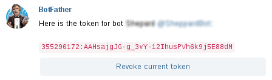

# Tkg Bot


[](https://travis-ci.org/vitaliyp/tkgbot)

Telegram bot that sends notifications about new messages on [tkg.org.ua](https://tkg.org.ua).

# Quickstart

## Download and Install

1. Glone this repository

```
$ git clone https://github.com/vitaliyp/tkgbot
```

2. Install pipenv

```
$ pip install pipenv
```

3. Install dependencies

```
$ pipenv sync
```

4. Initialize database

```
$ pipenv run python -c "from tkgbot import database; database.init_db()"
```

## Configure

  1. Create new [Telegram bot](https://core.telegram.org/bots#6-botfather) or use existing one. You need to get `token` from BotFather:

<center>

</center>

  2. Create account on [tkg.org.ua](https://tkg.org.ua/user/register).

  3. Set environment variables (syntax may vary - check instructions for your shell):

```
$ export TELEGRAM_BOT_TOKEN="your_telegram_token"
$ export FORUM_LOGIN="your_tkg_forum_login"
$ export FORUM_PASSWORD="your_tkg_forum_passwork"
```

If you need to persist variables - check [instructions](https://help.ubuntu.com/community/EnvironmentVariables#Persistent_environment_variables) for your OS.

## Run

Step inside project's directory and simply do:

```
$ pipenv run python -m tkgbot
```

## (Optional) Run tests

Execute inside project directory:

```
$ pipenv run pytest
```
